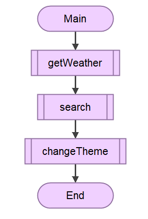
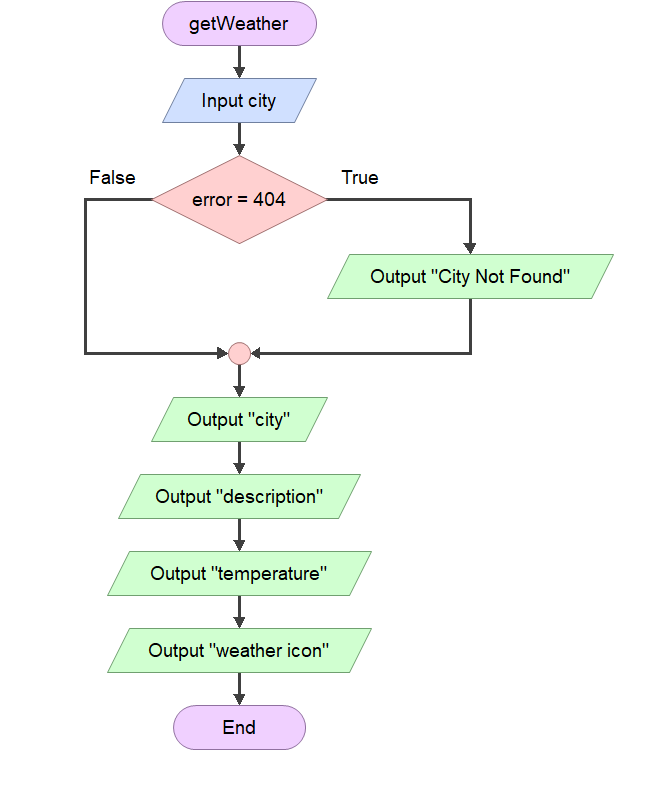
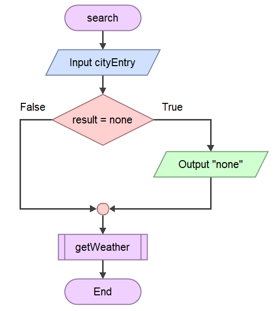

# 11ASE Task 1 2025 - WWeather App

#### By Victor Guo

## Requirements Definition
### Functional Requirements
**Data Retrieval:**\
 The user needs to be able to choose what data to delete, however, this data must not be from the API itself. This ensures that the application does not break due to the user unknowingly deleting something within the API that might stop the program from functioning properly.

**User Interface:**\
 The ability to click on buttons and read text is needed to use the program. It should be extremely easy to navigate through the user interface and if the user cannot understand, there should be a navigation guide on top of the search bar.

**Data Display:**\
 The User must be able to read the data from the API but not be able to change without permission. This again helps keep the application running. The data must also be as accurate as possible in order to make sure that the user recieves the right information upon using the app.

### Non-Functional Requirements
**Performance:**\
 This program needs to run smoothly on even the oldest devices (the test will be my MacBook Air from 2013, an 11 year old machine which struggles to run the web browser). Performance should be maintained when using different platforms, so the user can user is confident that they can run it on their computer.

**Reliability:**\
 The system actually does need to be extremely reliable as the user's data is a top priority and must not be leaked, so the system needs to be extremely reliable and store the data securely on all operating systems, and must not be flagged as insecure on any of them. This way the user who is going to install the application can be sure that they are not harming their computer.

**Usability and Accessibility:**\
  The system needs to be easy to navigate so that people who are not very familiar with computers can easily understand how it works. All there will need to be is a how to file showing what each button leads to. This program will also need to work on all desktop operating systems (will test using Windows, MacOS and Some Linux Kernels), which will make it widely accessible and run with no compatibility issues.

## Determining Specifications
### Functional Specifications
**User Requirements:**\
The user needs to be able to easily navigate the application even if they have never encountered it before, hopefully even without the guide. 

**Inputs & Outputs:**\
The user inputs text containing the location that they would like to find the weather for. The outputs are the weather for that city, including the temperature in degrees celsius and the weather description e.g. partly cloudy, this shall be done by fetching and outputting data from the API.

**Core Features:**\
The program needs to accept user input so that they can enter the name of a valid city. Another aspect of function is the ability to detect invalid places so that the weather data that is displayed is as accurate as possible so that the user experience will not be negatively affected.The user needs to also be able to search for the place with a button once they have entered the name of the desired place into the search box (this would be preffered if the user could also press ENTER for the same function).

**User Interaction:**\
The program needs to be able to display the temperature and the description of the weather from the API in a GUI (Graphical User Interface). This makes it easy for the user to find exactly what they want without needing to know much about using a computer.

**Error Handling:**\
What possible errors could you face that need to be handled by the system?\
An error that could be faced that needs to be handled by the system is in the instance that the user enters an invalid location. This will be handled by a pop-up message that reads 'City Not Found'. 

### Non-Functional Specifications
**Performance:**\
The system should fetch weather data as fast as possible so that the user does not feel as though they are working with a bloated application. The application should also feel smooth while running, having smooth animations and seamless theme changes, ensuring that it performs well.

**Useability / Accessibility:**\
How might you make your application more accessible? What could you do with the User Interface to improve usability?\
The user interface must be at least semi-aesthetic in order to make the user feel at home, preventing strain due to unnecessary text. On top of this, the application should launch the first time after installing the dependencies so that the user needs minimal time to retrieve weather data.

**Reliability:**\
A potential issue that needs to be adressed is the incorrect data when fetching data from the API. An example of this is when the user searches up a city such as 'Zhuzhou' (real place) and it comes up as 'Jianning' instead. This cannot be fixed as there seems to be a mismatch of data from the API itself (it labels Zhuzhou as Jianning and Jianning as something else.) Another issue is that the current weather app cannot distinguish places with the same name. These can hopefully be fixed easily.

## Design
### Gantt Chart

Link to Gantt Chart: https://lucid.app/lucidspark/162a4a9b-0462-4f05-9b21-b1997af60854/edit?invitationId=inv_9c51b1d8-6a9c-4b3f-bf6d-b49fa2d28f11&page=uDe-dIt-NWfS#

### Flowchart
\
\


### Structure Chart


### Data Dictionary
|Variable|Data Type|Format for Display|Size in Bytes|Size for Display|Description|Example|Validation|
|--------|---------|------------------|-------------|----------------|-----------|-------|----------|
|location|string|text|50|50|the name of the place|Sydney|Must be place on google maps|
|temperature|float|2 decimal number|8|4|the temparature at the place|21.62|must be between -273.15 and 100.00|
|degrees|string|2 character measurement|20|20|measurement for temperature|°C|must be either °C|
|description|string|text|100|100|the weather for that place|Partly Cloudy|must be valid desription|

### Pseudocode
``` python
BEGIN mainloop
  WHILE running
    FUNCTION get_weather
    FUNCTION search
    FUNCTION change_theme
  ENDWHILE
END mainloop

BEGIN get_weather
  IF city status code IS 404 THEN
    DISPLAY City Not Found
  ELSE
    RETURN icon_url
    RETURN temperature
    RETURN description
    RETURN city
    RETURN country
  ENDIF
END get_weather

BEGIN change_theme
  IF selected_theme is selected THEN
    use selected_theme
  ENDIF

BEGIN search
  INPUT city
  result = FUNCTION get_weather
  IF result IS NONE THEN
        RETURN NONE
  ELSE
    FUNCTION get_weather
  ENDIF
```
## Development
Development No.1:
```python
import tkinter as tk
 
 root  = tk.Tk()
 root.title("Window")
 root.configure(background = "white")
 root.minsize(200, 200)
 root.geometry("600x600+400+200")
 
 Button1 = tk.Button(root, text= "Click to see if you are dumb").pack()
 Button2 = tk.Button(root, text= "Click to see if you are gullible").pack()
 root.mainloop()
```
Development No.2:
```python
root = tk.Tk()
root.title("Window")
root.configure(background = "white")
root.minsize(200, 200)
root.geometry("1280x720+500+250")
 
 Text1 = Label(root, text= "This is to see if you are an idiot")
 Text2 = Label(root, text= "If you are reading this you have spent at least 1 second on this app")
 # Text1.grid(row=0, column=0)
 # Text2.grid(row=0, column=100)
 Text1.pack()
 Text2.pack()
 
 def darkMode():
     # darkText = Label(root, text= "Dark Mode not activated", fg="white")
         darkText = root.configure(background= "black")
         darkText.pack()
 
 Button1 = tk.Button(root, text= "Click to see if you are dumb")
 Button2 = tk.Button(root, text= "Click to see if you are gullible")
 Button3 = tk.Button(root, text= "Dark Mode", bg= "black", fg="white", command=darkMode)
 # Button1.grid(row=0, column=10)
 # Button2.grid(row=10, column=0)
 # Button3.grid(row= 1, column=1)
 
 Button1.pack()
 Button2.pack()
 Button3.pack()
```
Development No.3:
```python
root.title("Window")
root.configure(background = "white")
root.minsize(200, 200)
root.geometry("1280x720+400+200")
Text1 = Label(root, text= "This is to see if you are an idiot")
Text2 = Label(root, text= "If you are reading this you have spent at least 1 second on this app")
Text1.pack()
Text2.pack()
def gullibility():
       times = Button2.clicked()
       print(f"This user has clicked the button {times} times")
 
 def darkMode():
     # darkText = Label(root, text= "Dark Mode not activated", fg="white")
         is_dark = root.cget("bg")
         is_light = "white" if is_dark == "black" else "black"
         darkText = root.configure(background= is_light)
     # darkText.pack()
         while root.configure(background= is_dark):
                 Button3 = tk.Button(root, text= "Light Mode", bg= "white", fg="black", command=darkMode)
                 if root.configure(background= is_light):
                     pass 
                 else:
                     continue
 
 Button1 = tk.Button(root, text= "Click to see if you are dumb")
 Button2 = tk.Button(root, text= "Click to see if you are gullible", command=gullibility)
 Button3 = tk.Button(root, text= "Dark Mode", bg= "black", fg="white", command=darkMode)
 # Button1.grid(row=0, column=10)
 # Button2.grid(row=10, column=0)
 # Button3.grid(row= 1, column=1)
 
 Button1.pack()
 Button2.pack()
 Button3.pack()
```
Development No.4:
```python
 api_key = "8f19c2c2e8a325a07b2c35bfe43d861b"
 
 import requests
 from tkinter import *
 import tkinter as tk
 
 ### Thanks to Arpan Neupane for the text based application, I have followed his video tutorial.
 user_input = input("Enter City: ")
 
 weather_data = requests.get(f'https://api.openweathermap.org/data/2.5/weather?q={user_input}&units=metric&APPID={api_key}')
 
 if weather_data.json()['cod'] == '404':
        print("No City Found")
 
 else:
     weather = weather_data.json()['weather'][0]['main']
     temp = weather_data.json()['main']['temp']
     print(f"The weather in {user_input} is {weather}.")
     print(f"The temperature in {user_input} is {temp}°C.")
 
 ### From here on the rest is by me
 
 root = tk.Tk()
 root.title("Window")
 root.configure(background = "white")
 # root.minsize(200, 200)
 # root.geometry("1280x720+400+200")
 
 Text1 = Label(root, text= "This is to see if you are an idiot")
 Text2 = Label(root, text= "If you are reading this you have spent at least 1 second on this app")
 Text2.pack()
 
 def gullibility():
       print(f"This user has clicked the button: Gullible")
 
 def darkMode():
     # darkText = Label(root, text= "Dark Mode not activated", fg="white")
         is_dark = root.cget("bg")
         is_light = "white" if is_dark == "black" else "black"
         darkText = root.configure(background= is_light)
     # darkText.pack()
 
 Button1 = tk.Button(root, text= "Click to see if you are dumb")
 Button2 = tk.Button(root, text= "Click to see if you are gullible", command=gullibility)
 Button3 = tk.Button(root, text= "Dark Mode", bg= "black", fg="white", command=darkMode)
 # Button1.grid(row=0, column=10)
 # Button2.grid(row=10, column=0)
 # Button3.grid(row= 1, column=1)
 
 Button1.pack()
 Button2.pack()
 Button3.pack()
```
Development No.5:
```python
import requests
 from tkinter import *
 from tkinter import messagebox
 import tkinter as tk
 import ttkbootstrap
 # from PIL import Image, ImageTk
 
 root = ttkbootstrap.Window(themename="morph")
 root.title("Weather App From Youtube")
 root.geometry("400x400")

 title_text = tk.Label(root, text="W-Weather", font="Helvetica, 36")
 title_text.pack(pady=15)

 # Text1 = Label(root, text= "This is to see if you are an idiot")
 # Text2 = Label(root, text= "If you are reading this you have spent at least 1 second on this app")
 # Text1.grid(row=0, column=0)
 # Text2.grid(row=0, column=100)

 # Text1.pack()
 # Text2.pack()

 # def gullibility():
       # print(f"This user has clicked the button: Gullible")
 
 # def darkMode():
     # darkText = Label(root, text= "Dark Mode not activated", fg="white")
     # is_dark = root.cget("bg")
     # is_light = ttkbootstrap.Window(themename="morph") if is_dark == ttkbootstrap(themename="superhero") else ttkbootstrap(themename="superhero")
     # is_light = "white" if is_dark == "black" else "black"
     # darkText = root.configure(background= is_light)
     # darkText.pack()

 def search():
     city = city_entry.get()
     result = get_weather(city)
     if result is None:
         return
 
     icon_url, temperature, description, city, country = result
     location_label.configure(text=f"{city}, {country}")
 
     image = Image.open(requests.get(icon_url, stream=True).raw)
     icon = ImageTk.PhotoImage(image)
     icon_label.configure(image=icon)
     icon_label.image = icon
 
     temperature_label.configure(text=f"Temperature: {temperature:.2f}°C")
     description_label.configure(text=f"Description: {description}")
 
 city_entry = ttkbootstrap.Entry(root, font= "Helvetica, 18")
 city_entry.pack(pady=5)
 
 search_button = ttkbootstrap.Button(root, text="Get Weather", command=search, bootstyle="warning")
 search_button.pack(pady=10)
 
 location_label = tk.Label(root, font= "Helvetica, 25")
 location_label.pack(pady=20)
 
 icon_label = tk.Label(root)
 icon_label.pack()
 
 temperature_label = tk.Label(root, font="Helvetica, 20")
 temperature_label.pack()
 
 description_label = tk.Label(root, font="Helvetica, 20")
 description_label.pack()
 
 # Button1 = tk.Button(root, text= "Click to see if you are dumb")
 # Button2 = tk.Button(root, text= "Click to see if you are gullible", command=gullibility)
 # Button3 = tk.Button(root, text= "Dark Mode", bg= "black", fg="white", command=darkMode)
 # Button1.grid(row=0, column=10)
 # Button2.grid(row=10, column=0)
 # Button3.grid(row= 1, column=1)
 # Button1.pack()
 # Button2.pack()
 # Button3.pack()
 root.mainloop()
```
Development No.6:
```python
from tkinter import messagebox
import tkinter as tk
import ttkbootstrap
from PIL import Image, ImageTk
# Button1 = tk.Button(root, text= "Click to see if you are dumb")
 # Button2 = tk.Button(root, text= "Click to see if you are gullible", command=gullibility)
 # Button3 = tk.Button(root, text= "Dark Mode", bg= "black", fg="white", command=darkMode)
 # Button1.grid(row=0, column=10)
 # Button2.grid(row=10, column=0)
 # Button3.grid(row= 1, column=1)
 # Button1.pack()
 # Button2.pack()
 # Button3.pack()
 
 def get_weather(city):
     api_key_one = "8f19c2c2e8a325a07b2c35bfe43d861b"
     # api_key_two = "ce6207a53a45475db3c90051252703"
     url_one = f'https://api.openweathermap.org/data/2.5/weather?q={city}&units=metric&APPID={api_key_one}'
     # url_two = f'http://api.weatherapi.com/v1/forecast.json?key={api_key_two}&q={city}&days=1&aqi=no&alerts=no'
     res_one = requests.get(url_one)
     # res_two = requests.get(url_two)
 
     if res_one.status_code == 404:
         messagebox.showerror("Error", "City Not Found")
         return None
     
     # if res_two.status_code == 404:
         # messagebox.showerror("Error", "City Not Found")
         # return None
     
     weather_one = res_one.json()
     # weather_two = res_two.json()
     print(f'{weather_one}\n')
     # print(weather_two)
     icon_id = weather_one["weather"][0]["icon"]
     temperature = weather_one["main"]["temp"]
     description = weather_one["weather"][0]["description"]
     city = weather_one["name"]
     country = weather_one["sys"]["country"]
 
     icon_url = f"https://openweathermap.org/img/wn/{icon_id}@2x.png"
     return (icon_url, temperature, description, city, country)
 
 def search():
    city = city_entry.get()
     result = get_weather(city)
     if result is None:
         return
 
     icon_url, temperature, description, city, country = result
     location_label.configure(text=f"{city}, {country}")
 
     image = Image.open(requests.get(icon_url, stream=True).raw)
     icon = ImageTk.PhotoImage(image)
     icon_label.configure(image=icon)
     icon_label.image = icon
 
     temperature_label.configure(text=f"Temperature: {temperature:.2f}°C")
     description_label.configure(text=f"Description: {description}")

 root = ttkbootstrap.Window(themename="morph")
 root.title("Weather App From Youtube")
 root.geometry("600x600")
 
 title_text = tk.Label(root, text="W-Weather", font="Helvetica, 36")
 title_text.pack(pady=15)
 
 city_entry = ttkbootstrap.Entry(root, font= "Helvetica, 18")
 city_entry.pack(pady=10)
 root.bind('<Return>', get_weather)
 search_button = ttkbootstrap.Button(root, text="Search", command=search, bootstyle="warning")
 search_button.pack(pady=10)
 location_label = tk.Label(root, font = "Helvetica, 25")
 location_label.pack(pady=20)
 icon_label = tk.Label(root)
 icon_label.pack()
 
 temperature_label = tk.Label(root, font="Helvetica, 20")
 temperature_label.pack()
 
 description_label = tk.Label(root, font="Helvetica, 20")
 description_label.pack()
root.mainloop()
```
From this point on, the program was moved to another file called 'my_module.py'.

Development No.7:
```python
# main.py
import my_module as m

 m.root.mainloop()

# my_module.py
import requests
 from tkinter import *
 from tkinter import messagebox
 import tkinter as tk
 import ttkbootstrap
 from PIL import Image, ImageTk
 
 # Huge thanks to 
 
 def get_weather(city):
     api_key_one = "8f19c2c2e8a325a07b2c35bfe43d861b"
     # api_key_two = "ce6207a53a45475db3c90051252703"
     url_one = f'https://api.openweathermap.org/data/2.5/weather?q={city}&units=metric&APPID={api_key_one}'
     # url_two = f'http://api.weatherapi.com/v1/forecast.json?key={api_key_two}&q={city}&days=1&aqi=no&alerts=no'
     res_one = requests.get(url_one)
     # res_two = requests.get(url_two)
 
     # If the user enters error, the program will output 'City Not Found'
     if res_one.status_code == 404:
         messagebox.showerror("Error", "City Not Found")
         return None
     
     # if res_two.status_code == 404:
         # messagebox.showerror("Error", "City Not Found")
         # return None
     
     weather_one = res_one.json()
     # weather_two = res_two.json()
     print(f'{weather_one}\n')
     # print(weather_two)
     icon_id = weather_one["weather"][0]["icon"]
     temperature = weather_one["main"]["temp"]
     description = weather_one["weather"][0]["description"]
     city = weather_one["name"]
     country = weather_one["sys"]["country"]
 
     icon_url = f"https://openweathermap.org/img/wn/{icon_id}@2x.png"
     return (icon_url, temperature, description, city, country)
 
 def search():
     city = city_entry.get()
     result = get_weather(city)
     if result is None:
         return
 
     icon_url, temperature, description, city, country = result
     location_label.configure(text=f"{city}, {country}")
 
     image = Image.open(requests.get(icon_url, stream=True).raw)
     icon = ImageTk.PhotoImage(image)
     icon_label.configure(image=icon)
     icon_label.image = icon
 
     temperature_label.configure(text=f"Temperature: {temperature:.2f}°C")
     description_label.configure(text=f"Description: {description}")
 
 # Function to change the theme
 def change_theme(event):
     selected_theme = theme_menu.get()
     root.style.theme_use(selected_theme)
 
 # Create a window in ttkbootstrap
 root = ttkbootstrap.Window(themename="morph")
 # Give the window a name
 root.title("Weather App From Youtube")
 # Set the default resolution of the window
 root.geometry("600x600")
 
 # Display the Name of the weather application
 title_text = tk.Label(root, text="WWeather", font="Helvetica, 36")
 title_text.pack(pady=15)
 
 # Give the user a space to enter their city of choice
 city_entry = ttkbootstrap.Entry(root, font= "Helvetica, 18")
 city_entry.pack(pady=10)
 
 # Make the user able to simply press the ENTER key to fetch weather data (does not work yet)
 root.bind('<Return>', get_weather)
 
 
 # Create and display a search button in order to fetch the weather
 search_button = ttkbootstrap.Button(root, text="Search", command=search, bootstyle="warning")
 search_button.pack(pady=10)
 
 location_label = tk.Label(root, font = "Helvetica, 25")
 location_label.pack(pady=20)
 
 icon_label = tk.Label(root)
 icon_label.pack()
 
 temperature_label = tk.Label(root, font="Helvetica, 20")
 temperature_label.pack()
 
 description_label = tk.Label(root, font="Helvetica, 20")
 description_label.pack()
 
 theme_menu = ttkbootstrap.Combobox(root, values=root.style.theme_names(), state="readonly")
 theme_menu.set("Select Theme")  # Default text
 theme_menu.pack()
 theme_menu.bind("<<ComboboxSelected>>", change_theme)  # Event binding
 
 root.mainloop()
```
Here I also created another file for testing other functions that I wanted to add, such as an actually functional theme changer.
```python
# sample_code.py
import ttkbootstrap as ttk
from ttkbootstrap.constants import *
 
 # Function to change the theme
 def change_theme(event):
     selected_theme = theme_menu.get()
     app.style.theme_use(selected_theme)
 
 # Create the main application window
 app = ttk.Window(themename="cosmo")
 app.title("Theme Changer")
 app.geometry("300x150")
 
 # Dropdown menu for selecting themes
 theme_menu = ttk.Combobox(app, values=app.style.theme_names(), state="readonly")
 theme_menu.set("Select Theme")  # Default text
 theme_menu.pack(pady=30)
 theme_menu.bind("<<ComboboxSelected>>", change_theme)  # Event binding
 
 # Start the application
 app.mainloop()
```
Development No. 8:
```python
# main.py
import my_module as m
 
 m.root.geometry("1024x768")
 
 m.root.mainloop()

# my_module.py
import requests
 from tkinter import *
 from tkinter import messagebox
 import tkinter as tk
 import ttkbootstrap
 from PIL import Image, ImageTk
 
 # Huge thanks to 
 
 def get_weather(city):
     api_key_one = "8f19c2c2e8a325a07b2c35bfe43d861b"
     # api_key_two = "ce6207a53a45475db3c90051252703"
     url_one = f'https://api.openweathermap.org/data/2.5/weather?q={city}&units=metric&APPID={api_key_one}'
     # url_two = f'http://api.weatherapi.com/v1/forecast.json?key={api_key_two}&q={city}&days=1&aqi=no&alerts=no'
     res_one = requests.get(url_one)
     # res_two = requests.get(url_two)
 
     # If the user enters error, the program will output 'City Not Found'
     if res_one.status_code == 404:
         messagebox.showerror("Error", "City Not Found")
         return None
 
     # if res_two.status_code == 404:
         # messagebox.showerror("Error", "City Not Found")
         # return None
 
     weather_one = res_one.json()
     # weather_two = res_two.json()
     icon_id = weather_one["weather"][0]["icon"]
     temperature = weather_one["main"]["temp"]
     description = weather_one["weather"][0]["description"]
     city = weather_one["name"]
     country = weather_one["sys"]["country"]
 
     icon_url = f"https://openweathermap.org/img/wn/{icon_id}@2x.png"
     return (icon_url, temperature, description, city, country)
 
 def search():
     city = city_entry.get()
     result = get_weather(city)
     if result is None:
         return
 
     icon_url, temperature, description, city, country = result
     location_label.configure(text=f"{city}, {country}")
 
     image = Image.open(requests.get(icon_url, stream=True).raw)
     icon = ImageTk.PhotoImage(image)
     icon_label.configure(image=icon)
     icon_label.image = icon
 
     temperature_label.configure(text=f"Temperature: {temperature:.2f}°C")
     description_label.configure(text=f"Description: {description}")
 
 # Function to change the theme
 def change_theme(event):
     selected_theme = theme_menu.get()
     root.style.theme_use(selected_theme)
 
 # Create a window in ttkbootstrap
 root = ttkbootstrap.Window(themename="morph")
 # Give the window a name
 root.title("WWeather")
 # Sets the resolution that the window will open at
 root.geometry("1024x768")
 # Set the minimum resolution or 'size' of the window
 root.minsize(width=800, height=500)
 
 def resize_text(event):
     # Calculate font size based on window width
     new_font_size = int(event.width/20)
     if new_font_size < 36:  # Set a minimum font size
         new_font_size = 36
     title_text.config(font=("Helvetica", new_font_size))
 
 # Display the Name of the weather application
 title_text = tk.Label(root, text="WWeather", font=("Helvetica", 36))
 title_text.pack(expand=True, fill=tk.BOTH, pady=5)
 
 # Bind the <Configure> event to adjust text size dynamically
 root.bind("<Configure>", resize_text)
 
 # Give the user a space to enter their city of choice
 city_entry = ttkbootstrap.Entry(root, font= "Helvetica, 18")
 city_entry.pack(pady=10)
 
 # Make the user able to simply press the ENTER key to fetch weather data (does not work yet)
 root.bind('<Return>', get_weather)
 
 # Create and display a search button in order to fetch the weather
 search_button = ttkbootstrap.Button(root, text="Search", command=search, bootstyle="warning")
 search_button.pack(pady=10)
 
 location_label = tk.Label(root, font = "Helvetica, 25")
 location_label.pack(pady=20)
 
 # Create the icon for the weather description and place it in the GUI
 icon_label = tk.Label(root)
 icon_label.pack()
 
 temperature_label = tk.Label(root, font="Helvetica, 20")
 temperature_label.pack()
 
 description_label = tk.Label(root, font="Helvetica, 20")
 description_label.pack()
 
 theme_menu = ttkbootstrap.Combobox(root, values=root.style.theme_names(), state="readonly")
 theme_menu.set("Select Theme")  # Default text
 theme_menu.pack(pady=5)
 theme_menu.bind("<<ComboboxSelected>>", change_theme)  # Event binding
 
 root.mainloop()
```
Development No. 9:
```python
# main.py
import my_module as m

 m.root.mainloop()

# my_module.py
import requests
 from tkinter import *
 from tkinter import messagebox
 import tkinter as tk
 import ttkbootstrap
 from PIL import Image, ImageTk
 
 # Huge thanks to 
 
 def get_weather(city):
     api_key_one = "8f19c2c2e8a325a07b2c35bfe43d861b"
     # api_key_two = "ce6207a53a45475db3c90051252703"
     url_one = f'https://api.openweathermap.org/data/2.5/weather?q={city}&units=metric&APPID={api_key_one}'
     # url_two = f'http://api.weatherapi.com/v1/forecast.json?key={api_key_two}&q={city}&days=1&aqi=no&alerts=no'
     res_one = requests.get(url_one)
     # res_two = requests.get(url_two)
 
     # If the user enters error, the program will output 'City Not Found'
     if res_one.status_code == 404:
         messagebox.showerror("Error", "City Not Found")
         return None
 
     # if res_two.status_code == 404:
         # messagebox.showerror("Error", "City Not Found")
         # return None
 
     weather_one = res_one.json()
     # weather_two = res_two.json()
     icon_id = weather_one["weather"][0]["icon"]
     temperature = weather_one["main"]["temp"]
     description = weather_one["weather"][0]["description"]
     city = weather_one["name"]
     country = weather_one["sys"]["country"]
 
     icon_url = f"https://openweathermap.org/img/wn/{icon_id}@2x.png"
     return (icon_url, temperature, description, city, country)
 
 def search():
     city = city_entry.get()
     result = get_weather(city)
     if result is None:
         return
 
     icon_url, temperature, description, city, country = result
     location_label.configure(text=f"{city}, {country}")
 
     image = Image.open(requests.get(icon_url, stream=True).raw)
     icon = ImageTk.PhotoImage(image)
     icon_label.configure(image=icon)
     icon_label.image = icon
 
     temperature_label.configure(text=f"Temperature: {temperature:.2f}°C")
     description_label.configure(text=f"Description: {description}")
 
 # Function to change the theme
 def change_theme(event):
     selected_theme = theme_menu.get()
     root.style.theme_use(selected_theme)
 
 # Create a window in ttkbootstrap
 root = ttkbootstrap.Window(themename="morph")
 # Give the window a name
 root.title("WWeather")
 # Sets the resolution that the window will open at
 root.geometry("1024x768")
 # Set the minimum resolution or 'size' of the window
 root.minsize(width=800, height=500)
 
 def resize_text(event):
     # Calculate font size based on window width
     new_font_size = int(event.width/20)
     if new_font_size < 36:  # Set a minimum font size
         new_font_size = 36
     title_text.config(font=("Helvetica", new_font_size))
 
 # Display the Name of the weather application
 title_text = tk.Label(root, text="WWeather", font=("Helvetica", 36))
 title_text.pack(expand=True, fill=tk.BOTH, pady=5)
 
 # Bind the <Configure> event to adjust text size dynamically
 root.bind("<Configure>", resize_text)
 
 # Give the user a space to enter their city of choice
 city_entry = ttkbootstrap.Entry(root, font= "Helvetica, 18")
 city_entry.pack(pady=10)
 
 # Make the user able to simply press the ENTER key to fetch weather data (does not work yet)
 root.bind('<Return>', get_weather)
 
 # Create and display a search button in order to fetch the weather
 search_button = ttkbootstrap.Button(root, text="Search", command=search, bootstyle="warning")
 search_button.pack(pady=10)
 
 location_label = tk.Label(root, font = "Helvetica, 25")
 location_label.pack(pady=20)
 
 # Create the icon for the weather description and place it in the GUI
 icon_label = tk.Label(root)
 icon_label.pack()
 
 temperature_label = tk.Label(root, font="Helvetica, 20")
 temperature_label.pack()
 
 description_label = tk.Label(root, font="Helvetica, 20")
 description_label.pack()
 
 theme_menu = ttkbootstrap.Combobox(root, values=root.style.theme_names(), state="readonly")
 theme_menu.set("Select Theme")  # Default text
 theme_menu.pack(pady=5)
 theme_menu.bind("<<ComboboxSelected>>", change_theme)  # Event binding
 
 root.mainloop()
```
Development No. 10:
```python
# main.py
import my_module as m
 
 m.root.mainloop()

# my_module.py
import requests
 from tkinter import *
 from tkinter import messagebox
 import tkinter as tk
 import ttkbootstrap
 from PIL import Image, ImageTk
 
 # Huge thanks to 
 
 def get_weather(city):
     api_key_one = "8f19c2c2e8a325a07b2c35bfe43d861b"
     # api_key_two = "ce6207a53a45475db3c90051252703"
     url_one = f'https://api.openweathermap.org/data/2.5/weather?q={city}&units=metric&APPID={api_key_one}'
     # url_two = f'http://api.weatherapi.com/v1/forecast.json?key={api_key_two}&q={city}&days=1&aqi=no&alerts=no'
     res_one = requests.get(url_one)
     # res_two = requests.get(url_two)
 
     # If the user enters error, the program will output 'City Not Found'
     if res_one.status_code == 404:
         messagebox.showerror("Error", "City Not Found")
         return None
 
     # if res_two.status_code == 404:
         # messagebox.showerror("Error", "City Not Found")
         # return None
 
     weather_one = res_one.json()
     # weather_two = res_two.json()
     icon_id = weather_one["weather"][0]["icon"]
     temperature = weather_one["main"]["temp"]
     description = weather_one["weather"][0]["description"]
     city = weather_one["name"]
     country = weather_one["sys"]["country"]
 
     icon_url = f"https://openweathermap.org/img/wn/{icon_id}@2x.png"
     return (icon_url, temperature, description, city, country)
 
 def search():
     city = city_entry.get()
     result = get_weather(city)
     if result is None:
         return
 
     icon_url, temperature, description, city, country = result
     location_label.configure(text=f"{city}, {country}")
 
     image = Image.open(requests.get(icon_url, stream=True).raw)
     icon = ImageTk.PhotoImage(image)
     icon_label.configure(image=icon)
     icon_label.image = icon
 
     temperature_label.configure(text=f"Temperature: {temperature:.2f}°C")
     description_label.configure(text=f"Description: {description}")
 
 # Function to change the theme
 def change_theme(event):
     selected_theme = theme_menu.get()
     root.style.theme_use(selected_theme)
 
 # Create a window in ttkbootstrap
 root = ttkbootstrap.Window(themename="morph")
 # Give the window a name
 root.title("WWeather")
 # Sets the resolution that the window will open at
 root.geometry("1024x768")
 # Set the minimum resolution or 'size' of the window
 root.minsize(width=800, height=500)
 
 def resize_text(event):
     # Calculate font size based on window width
     new_font_size = int(event.width/20)
     if new_font_size < 36:  # Set a minimum font size
         new_font_size = 36
     title_text.config(font=("Helvetica", new_font_size))
 
 # Display the Name of the weather application
 title_text = tk.Label(root, text="WWeather", font=("Helvetica", 36))
 title_text.pack(expand=True, fill=tk.BOTH, pady=5)
 
 # Bind the <Configure> event to adjust text size dynamically
 root.bind("<Configure>", resize_text)
 
 # Give the user a space to enter their city of choice
 city_entry = ttkbootstrap.Entry(root, font= "Helvetica, 18")
 city_entry.pack(pady=10)
 
 # Make the user able to simply press the ENTER key to fetch weather data (does not work yet)
 root.bind('<Return>', get_weather)
 
 # Create and display a search button in order to fetch the weather
 search_button = ttkbootstrap.Button(root, text="Search", command=search, bootstyle="warning")
 search_button.pack(pady=10)
 
 location_label = tk.Label(root, font = "Helvetica, 25")
 location_label.pack(pady=20)
 
 # Create the icon for the weather description and place it in the GUI
 icon_label = tk.Label(root)
 icon_label.pack()
 
 temperature_label = tk.Label(root, font="Helvetica, 20")
 temperature_label.pack()
 
 description_label = tk.Label(root, font="Helvetica, 20")
 description_label.pack()
 
 theme_menu = ttkbootstrap.Combobox(root, values=root.style.theme_names(), state="readonly")
 theme_menu.set("Select Theme")  # Default text
 theme_menu.pack(pady=5)
 theme_menu.bind("<<ComboboxSelected>>", change_theme)  # Event binding
 
 root.mainloop()
```
I tried to move the API key, URL and Request out of the function, however, the program did not function, so I moved it back in.

Development No.11:
```python
import requests
from tkinter import *
from tkinter import messagebox
import tkinter as tk
import ttkbootstrap
from PIL import Image, ImageTk

# Huge thanks to Alina Chudnova for the main application

# Create a window in ttkbootstrap
root = ttkbootstrap.Window(themename="morph")
# Give the window a name
root.title("WWeather")
# Sets the resolution that the window will open at
root.geometry("1024x768")
# Set the minimum resolution or 'size' of the window
root.minsize(width=800, height=500)

# Function for getting the weather for the entererd location
def get_weather(city):
    """ Uses the API key to fetch and output the data from the url, making a request in the process
    
    Args: 
        icon_id (str): the identification for the icon that represents the weather
        temperature (float): the temperature of the entered location
        city (str): the entered location
        country (str): country the location is in
        description (str): weather description

    Returns: 
        .json file: includes the weather, an icon_id associated with the weather, temperature, city and country
    """
    api_key_one = "8f19c2c2e8a325a07b2c35bfe43d861b"
    url_one = f'https://api.openweathermap.org/data/2.5/weather?q={city}&units=metric&APPID={api_key_one}'
    res_one = requests.get(url_one)
    
    # If the user enters error, the program will output 'City Not Found'
    if res_one.status_code == 404:
        messagebox.showerror("Error", "City Not Found")
        return None
    
    ### Below is for the other, more accurate WeatherAPI which did not work for this program
    # api_key_two = "ce6207a53a45475db3c90051252703"
    # url_two = f'http://api.weatherapi.com/v1/forecast.json?key={api_key_two}&q={city}&days=1&aqi=no&alerts=no'
    # res_two = requests.get(url_two)
    # if res_two.status_code == 404:
        # messagebox.showerror("Error", "City Not Found")
        # return None
    
    weather_one = res_one.json()
    # weather_two = res_two.json()
    icon_id = weather_one["weather"][0]["icon"]
    temperature = weather_one["main"]["temp"]
    description = weather_one["weather"][0]["description"]
    city = weather_one["name"]
    country = weather_one["sys"]["country"]

    icon_url = f"https://openweathermap.org/img/wn/{icon_id}@2x.png"
    return (icon_url, temperature, description, city, country)

# Function to fetch weather from user entered location
def search():
    """ A search button that allows the user to actually search for the weather

        Args:
            city (str): the entered location
        
        Returns:
            a visual display of the results from the .json file. 
    """
    city = city_entry.get()
    result = get_weather(city)
    if result is None:
        return

    icon_url, temperature, description, city, country = result
    location_label.configure(text=f"{city}, {country}")

    image = Image.open(requests.get(icon_url, stream=True).raw)
    icon = ImageTk.PhotoImage(image)
    icon_label.configure(image=icon)
    icon_label.image = icon

    temperature_label.configure(text=f"Temperature: {temperature:.2f}°C")
    description_label.configure(text=f"Description: {description}")

# Function to change the theme
def change_theme(event):
    selected_theme = theme_menu.get()
    root.style.theme_use(selected_theme)

def resize_text(event):
    # Calculate font size based on window width
    new_font_size = int(event.width/20)
    if new_font_size < 36:  # Set a minimum font size
        new_font_size = 36
    title_text.config(font=("Helvetica", new_font_size))

# Display the Name of the weather application
title_text = tk.Label(root, text="WWeather", font=("Helvetica", 36))
title_text.pack(expand=True, fill=tk.BOTH, pady=5)

# Bind the <Configure> event to adjust text size dynamically
root.bind("<Configure>", resize_text)

# Give the user a space to enter their city of choice
city_entry = ttkbootstrap.Entry(root, font= "Helvetica, 18")
city_entry.pack(pady=10)

# Make the user able to simply press the ENTER key to fetch weather data (does not work yet)
root.bind('<Return>', get_weather)

# Create and display a search button in order to fetch the weather
search_button = ttkbootstrap.Button(root, text="Search", command=search, bootstyle="warning")
search_button.pack(pady=10)

# Outputs the location entered by the user
location_label = tk.Label(root, font= "Helvetica, 25")
location_label.pack(pady=20)

# Create the icon for the weather description and place it in the GUI
icon_label = tk.Label(root)
icon_label.pack()

# This will output the temperature of the entered location
temperature_label = tk.Label(root, font="Helvetica, 20")
temperature_label.pack()

# This will be the output of the description of the weather
description_label = tk.Label(root, font="Helvetica, 20")
description_label.pack()

#This uses the style.themenames function in Combobox in ttkbootstrap
theme_menu = ttkbootstrap.Combobox(root, values=root.style.theme_names(), state="readonly") # make it so that the user cannot add any themes that do not exist
theme_menu.set("Select Theme")  # Default text
theme_menu.bind("<<ComboboxSelected>>", change_theme)  # Bind the selection of the theme menu to a function that changes the theme
theme_menu.pack(pady=5)

root.mainloop()
```
Note: I just added some docstrings to explain the essential functions.

## Integration
Here is my code with the integration of my module. The mainloop was the only thing that would work once I brought it over. Also it is sort of cool making the program look like it is just two lines of code.
```python
### main.py
import my_module as m

m.root.mainloop()

### my_module.py
import requests
from tkinter import *
from tkinter import messagebox
import tkinter as tk
import ttkbootstrap
from PIL import Image, ImageTk

# Huge thanks to Alina Chudnova for the main application

# Create a window in ttkbootstrap
root = ttkbootstrap.Window(themename="morph")
# Give the window a name
root.title("WWeather")
# Sets the resolution that the window will open at
root.geometry("1024x768")
# Set the minimum resolution or 'size' of the window
root.minsize(width=800, height=500)

# Function for getting the weather for the entererd location
def get_weather(city):
    """ Uses the API key to fetch and output the data from the url, making a request in the process
    
    Args: 
        icon_id (str): the identification for the icon that represents the weather
        temperature (float): the temperature of the entered location
        city (str): the entered location
        country (str): country the location is in
        description (str): weather description

    Returns: 
        .json file: includes the weather, an icon_id associated with the weather, temperature, city and country
    """
    api_key_one = "8f19c2c2e8a325a07b2c35bfe43d861b"
    url_one = f'https://api.openweathermap.org/data/2.5/weather?q={city}&units=metric&APPID={api_key_one}'
    res_one = requests.get(url_one)
    
    # If the user enters error, the program will output 'City Not Found'
    if res_one.status_code == 404:
        messagebox.showerror("Error", "City Not Found")
        return None
    
    ### Below is for the other, more accurate WeatherAPI which did not work for this program
    # api_key_two = "ce6207a53a45475db3c90051252703"
    # url_two = f'http://api.weatherapi.com/v1/forecast.json?key={api_key_two}&q={city}&days=1&aqi=no&alerts=no'
    # res_two = requests.get(url_two)
    # if res_two.status_code == 404:
        # messagebox.showerror("Error", "City Not Found")
        # return None
    
    weather_one = res_one.json()
    # weather_two = res_two.json()
    icon_id = weather_one["weather"][0]["icon"]
    temperature = weather_one["main"]["temp"]
    description = weather_one["weather"][0]["description"]
    city = weather_one["name"]
    country = weather_one["sys"]["country"]

    icon_url = f"https://openweathermap.org/img/wn/{icon_id}@2x.png"
    return (icon_url, temperature, description, city, country)

# Function to fetch weather from user entered location
def search():
    """ A search button that allows the user to actually search for the weather

        Args:
            city (str): the entered location
        
        Returns:
            a visual display of the results from the .json file. 
    """
    city = city_entry.get()
    result = get_weather(city)
    if result is None:
        return

    icon_url, temperature, description, city, country = result
    location_label.configure(text=f"{city}, {country}")

    image = Image.open(requests.get(icon_url, stream=True).raw)
    icon = ImageTk.PhotoImage(image)
    icon_label.configure(image=icon)
    icon_label.image = icon

    temperature_label.configure(text=f"Temperature: {temperature:.2f}°C")
    description_label.configure(text=f"Description: {description}")

# Function to change the theme
def change_theme(event):
    selected_theme = theme_menu.get()
    root.style.theme_use(selected_theme)

def resize_text(event):
    # Calculate font size based on window width
    new_font_size = int(event.width/20)
    if new_font_size < 36:  # Set a minimum font size
        new_font_size = 36
    title_text.config(font=("Helvetica", new_font_size))

# Display the Name of the weather application
title_text = tk.Label(root, text="WWeather", font=("Helvetica", 36))
title_text.pack(expand=True, fill=tk.BOTH, pady=5)

# Bind the <Configure> event to adjust text size dynamically
root.bind("<Configure>", resize_text)

# Give the user a space to enter their city of choice
city_entry = ttkbootstrap.Entry(root, font= "Helvetica, 18")
city_entry.pack(pady=10)

# Make the user able to simply press the ENTER key to fetch weather data (does not work yet)
root.bind('<Return>', get_weather)

# Create and display a search button in order to fetch the weather
search_button = ttkbootstrap.Button(root, text="Search", command=search, bootstyle="warning")
search_button.pack(pady=10)

# Outputs the location entered by the user
location_label = tk.Label(root, font= "Helvetica, 25")
location_label.pack(pady=20)

# Create the icon for the weather description and place it in the GUI
icon_label = tk.Label(root)
icon_label.pack()

# This will output the temperature of the entered location
temperature_label = tk.Label(root, font="Helvetica, 20")
temperature_label.pack()

# This will be the output of the description of the weather
description_label = tk.Label(root, font="Helvetica, 20")
description_label.pack()

#This uses the style.themenames function in Combobox in ttkbootstrap
theme_menu = ttkbootstrap.Combobox(root, values=root.style.theme_names(), state="readonly") # make it so that the user cannot add any themes that do not exist
theme_menu.set("Select Theme")  # Default text
theme_menu.bind("<<ComboboxSelected>>", change_theme)  # Bind the selection of the theme menu to a function that changes the theme
theme_menu.pack(pady=5)

root.mainloop()
```
## Testing and Debugging
4/3/2025\
Added Basic Structure for Project Development\
Today I added the subheadings for the Documentation and Theory. This sets out the backbone for the theory that is required in the future. I plan to complete the Requirements Definition shortly after.

10/3/2025\
Added a TKinter window to main.py\
Today I added a window and two non-functional buttons to the main.py file. This program is just a placeholder and will not be included in my final project, just me learning TKinter. 

11/3/2025\
Added Dark Mode\
Today I added a Dark Mode to the sample program. This was partially because I was lost on what to do even though I could have been working on the theory and documentation. The feature may be removed in the furture.

17/3/2025\
Broke Dark Mode\
Today I tried to make it so that when you press the dark mode button again it will switch back to light mode. I thought this would work, however it did not function as expected. Again, I don't have a single clue on why I made this if there was already a sample program in place when I could have been working on the theory and Documentation.

18/3/2025\
Followed an existing tutorial to create text based application, credited in the first comment\
Today I reverted the dark mode function back to what it was before and followed a YouTube tutorial for a python based weather application by Arpan Neupane. This would help form part of the backbone of the final program.

24/3/2025\
Followed a YouTube tutorial to change into GUI\
Today I followed a YouTube tutorial by Alina Chudnova to turn the text based application into an application with a GUI (Graphical User Interface). This application is still used in the file which is now 'my_module.py'.

25/3/2025\
Added the link to the Gantt Chart\
Today I finished creating the Gantt Chart, which is under the design section in the theory/documentation. I was going to take a screenshot later when I got home (I have a 4k monitor and I thought this would make it clearer), however, I forgot and just left it as is.

27/3/2025\
UPDATED main.py\
Today I made some changes to the main.py file which was the file which I copied the YouTube tutorial on. At this point I have not yet created a file called 'my_module.py'. This may or may not remain in the final program. I also have no clue why I have not credited their tutorial yet.

30/3/2025\
Created Gantt Chart.png\
Today I inserted the 'Gantt Chart.png' image as part of the documentation of time planning (yes, I finally rememered to take a screenshot). I also made some changes to the theory side, but they were not showing up, leading me to think that GitHub Desktop was not working properly (hence the next commit on the same day.)

Added some to the 'theory' side\
Needless to say, it was not an error with GitHub Desktop, I just did not know that autosave was not on. Anyways I finally enabled it and roughly finished the Requirements and Specifications and touched on the Design aspect of the task with the Gantt Chart. These will be poilished over the following week otherwise the situation could turn dire.

31/3/2025\
Added theme changer\
Today I added a working theme changer using the Combobox function built into ttkbootstrap (combo = combination/selection, box = container, combobox = selection container). This allowed me to remove the dark mode for good, instead opting for a theme selector (ttkboostrap has more aesthetic themes).

Modified my_module.py\
I also learnt how to create dynamically adjusting text in TKinter, which I applied to the title of the weather application to make it more realistic, however, it only works after being minimised then reopened. I originally thought that this could have been because of my computer's slow processing due to having to process more pixels (as documented in the GitHub commit), however, the same thing happened on the school desktop, so it turns out that ttkbootstrap is slightly different to TKinter. I also removed an unnecessary line of code (I do not know why that had to be a separate commit.)

1/4/2025\
Added some things to the theory\
Today I completed the data dictionary and completed some of the pseudocode. I will begin to work on the structure charts later. Also I tried moving the API key to the front, however the program does not work in that configuration, so I moved it back to where it was before.

Added the flowcharts and some commits\
Here I began documenting the commits that I made on GitHub in PROJECT_DEVELOPMENT.md and with more detail. This helped me understand and connect with the project on a deeper level. I should remember to add more detail in my future commits.

3/4/2025\
Completed more of the theory work\
Today I completed most of testing and debugging and all the development that I can do. I will be documenting commits both in VSCode and GitHub Desktop from now on. The aim for today was to complete the structure charts, however, I wish to take a break due to completing a substantial amount of work compared to the amount of progress that I have made so far. In the future, I shall finish the structure chart for the program and work on the 'Integration' section, which will make me up to scratch for completion on Monday 7/4.

6/4/2025\
Completed Integration and Development\
Today I completed the Development and Integration parts of the theory. I also added docstrings to the main functions, as well as completed the requirements.txt file. This means that I only have the Installation and Maintenance parts to be completed, which are really short. I likely will not complete the task by tomorrow as mentioned in my previous commits, however, maybe I will be done by Wednesday.

7/4/2025\
Finally Completed the task!\
Today I have completely finished the task and am ready for submission. This means that I will not be adding more to the theory and side of the task.
## Installation
README.md
```python
# WWeather
A really basic weather app made with python that does not completely suck.

## Installation
Clone the repository and navigate to the project directory:
11ASE_Task-1/main/main.py

Then run the file after installing the dependencies in 'requirements.txt'.

If you would like to create your own API key for this app, sign up for OpenWeatherMap and create your own key at https://home.openweathermap.org/api_keys. This is not necessary as there is already one provided for use.

## Features
- Fetch weather data based on the user entered location or a specified city.
- Display current weather conditions, including temperature, and weather description. There is even an icon description of the weather.

## Requirements
To run this program, you need to install the following dependencies:

- `ttkbootstrap` for the main window.
- `requests` to make HTTP requests to the weather API.
- `tkinter` for displaying the weather
- `pillow` to display an icon for the weather.

### Install dependencies
To install the required dependencies, you can run:

bash:
pip install -r requirements.txt
```
requirements.txt
```python
ttkbootstrap == 1.10.1
pillow == 10.0.0
tkinter == 8.6.15
requests == 2.31.0
```

## Maintenance
### Maintenance Questions
**1. Explain how you would handle issues caused by changes to the weather API over time.**\
Since the application is only for fetching data, there will be no need to worry about changes to the API over time unless it gets locked behind a paywall. In the event that this does happen, there will likely be a free trial for the API, so the user can continuously generate API keys using a temporary email generator and a free trial.

**2. Explain how you would ensure the program remains compatible with new versions of Python and libraries like requests and matplotlib.**\
I would not need to make changes to the program as the newer versions of these libraries should have the older versions within them. Also, the user will be installing the older version if they are installing through the requirements.txt file so there should not be an issue as the older version will still be available.

**3. Describe the steps you would take to fix a bug found in the program after deployment.**\
To fix a bug foiund after deployment I would first make the repository private, then try to fix the bug by removing all the unnecessary functions, then add each of the less important functions one at a time to try and find the bug. This is essentially the same process as first decomposing the program, then beginning Unit Testing, then Integration Testing and finally System Testing.

**4. Outline how you would maintain clear documentation and ensure the program remains easy to update in the future.**\
The README file will be updated every time there is a new release, and the Comments and DocStrings would make it easy to understand what each function does and what it is for. This provides clear documentation for making the program easy to update in the future.

### Final Evaluation

**1. Evaluate the current functionality of the program in terms of how well it addresses the functional and non-functional requirements.**\
This weather app addresses most of the Functional and Non-Functional Requirements, however it has missed out on the user being able to choose what data to delete as there is nothing being stored in the first place apart from cache files. On the bright side, it addresses all of the Non-Functional Requirements and all of the Specifications, satisfying all the desired inputs and outputs.

**2. Discuss areas for improvement or new features that could be added.**\
If I were to improve on this program, I would try to make it so that it uses the Weather API instead of the OpenWeatherMap as it would be more accurate. This would improve the overall user satisfaction due to the user experience being elevated.

**3. Evaluate how the project was managed throughout its development and maintenance, including your time management and how challenges were addressed during the software development lifecycle.**\
Overall, this project was managed moderately well, with most of the workload being towards the end of the duration of the task. Challenges were addressed rather moderately, with the solution being mainly to revert back to when the program had no errors, leading to a rather safe approach to the development.